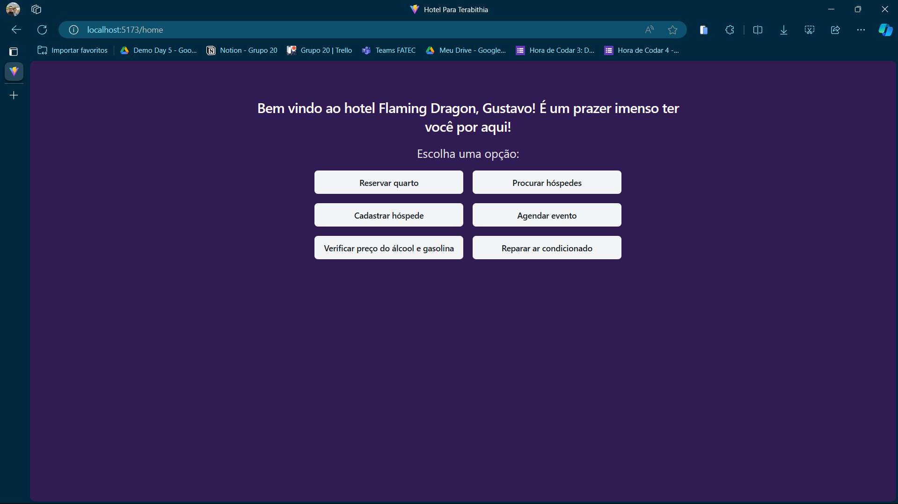

# Hotel Flaming Dragon

## 📖 Sobre o Projeto
Todo mundo quer aprender a trabalhar com código, mas nós vamos além do código.
Sua capacidade de analisar um problema é a habilidade mais importante que você pode desenvolver.
Os problemas abaixo possuem um contexto mais rebuscado, mas vamos encontrar soluções.

*Um hotel em Terabithia* é uma atividade onde precisamos por em prática muitos conceitos desenvolvidos durante as aulas de lógica de programação, como manipulação de variáveis, arrays e objetos.

Resolvi desenvolver o *Hotel Flaming Dragon (Hotel Dragão Flamejante)* como uma forma de aplicar os conceitos de lógica com React e Typescript.

## 🚀 Tecnologias utilizadas
- ReactJS (vite);
- Typescript;
- TailwindCSS + ShadcnUI Components;

## ⚒️ Funcionalidades do site

- Tela de **login** com verificação de senha;
- Salvamento de dados com **Session Storage**;
- Uso de **estados, arrays e objetos**;
- Uso de **Context API**;
- Design **Responsivo**;

## 🚀 Acesse a demo do site

Acesse o deploy da aplicação <a href="https://hotel-flaming-dragon.vercel.app/">por aqui!</a>.
